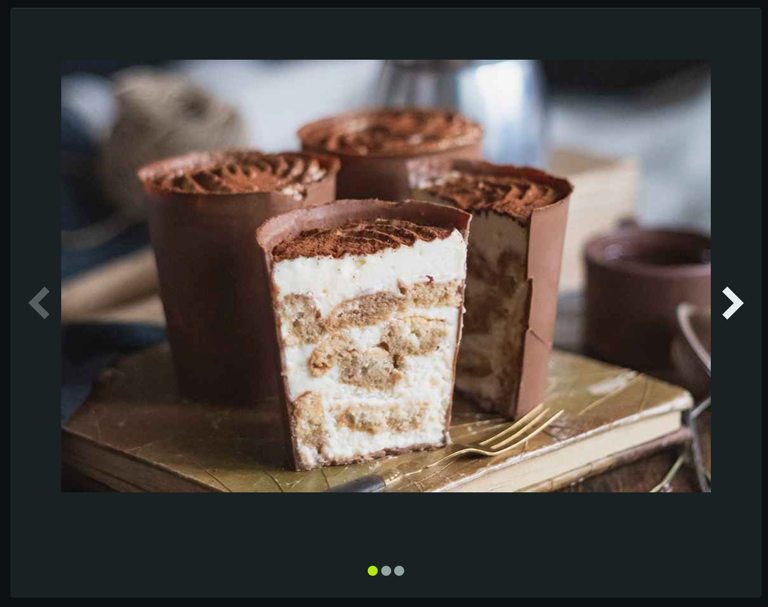

# Frontend Interview
After working on the backend app we need to implement it on the frontend

We need to build gallery to show the images endpoint

Please feel free to refactor the code as you see, while ensuring that it remains in JS/TS.

## Task:
Build page with two layouts, the way change between the layouts will be toggle button 

The layouts will be:
* carousel don't use package 
* full gallery

## Examples 
The images illustration the requirements 
### carousel

### Gallery
